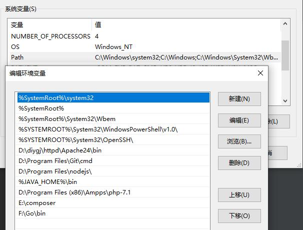
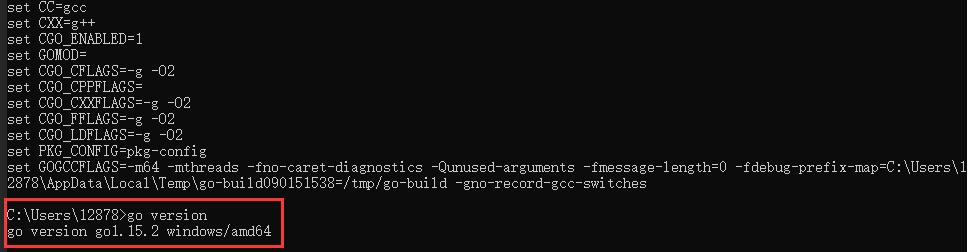
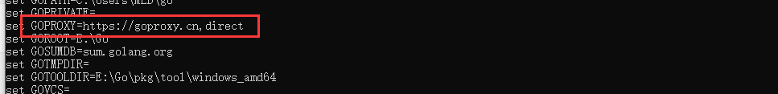
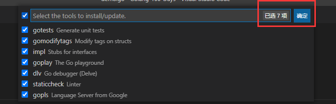
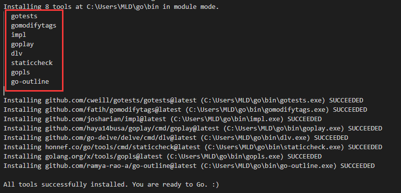

#### 环境搭建

#### windows

0. 下载Go包，执行安装包
````
https://github.com/golang/go #项目
https://golang.google.cn/dl/ #安装包
https://golang.google.cn/doc/install #安装说明

Go 版本：1.15.2
````

1.  配置环境变量

    右键此电脑->属性->高级系统设置->环境变量
    新增配置：PATH：Go安装目录/bin



2. 验证
   
   go version #查看版本
    go env #环境信息



3.设置[代理](https://goproxy.cn/)

```
# 开启 Go Modules模式并设置代理
go env -w GO111MODULE=on
go env -w GOPROXY=https://goproxy.cn,direct
```




#### 目录

    bin
    存放编译后可执行的文件。
    
    pkg
    存放编译后的应用包。
    
    src
    存放应用源代码。

#### 命令

    go build hello
    在src目录或hello目录下执行 go build hello，只在对应当前目录下生成文件。
    
    go install hello
    在src目录或hello目录下执行 go install hello，会把编译好的结果移动到 $GOPATH/bin。
    
    go run hello
    在src目录或hello目录下执行 go run hello，不生成任何文件只运行程序。
    
    go fmt hello
    在src目录或hello目录下执行 go run hello，格式化代码，将代码修改成标准格式。

#### ide

- GoLand：GoLand 是 JetBrains 公司推出的 Go 语言集成开发环境。
  [下载](http://c.biancheng.net/view/6124.html)

- Visual Studio Code：免费，无律师函风险（企业开发建议），轻量占用内存非常低。推荐安装编辑器扩展：Go、Chinese (Simplified) 、Git Blame（追踪代码提交记录）
  - 安装go扩展

​		Windows平台按下`Ctrl+Shift+P`，Mac平台按`Command+Shift+P`，这个时候VS Code界面会弹出一个输入框，输入 `Go:Install/Update Tools`，全选确定。





[下载](https://code.visualstudio.com/Download)

#### 网址

- Go语言：https://golang.org/

- Go语言中文网：https://studygolang.com/

- Go语言包管理：https://gopm.io/